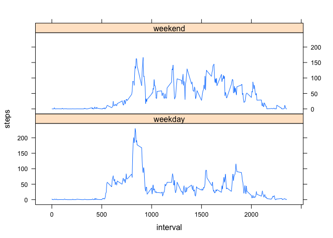

# Reproducible Research: Peer Assessment 1
##Preparing R environment
Needed R libraries for the analysis are set. Set working directory to git repository for assignment. 


```r
rm(list = ls())
library(stats)
library(dplyr)
```

```
## 
## Attaching package: 'dplyr'
## 
## The following objects are masked from 'package:stats':
## 
##     filter, lag
## 
## The following objects are masked from 'package:base':
## 
##     intersect, setdiff, setequal, union
```

```r
library(knitr)
library(lattice)

setwd("/Users/dammd/DataAnalysis/DS-05-ReproducibleResearch/RepData_PeerAssessment1")
```

## Loading and preprocessing the data


```r
rawdata<- read.csv("activity.csv", colClasses = c("numeric", "character", "numeric"))
rawdata$date<-as.Date(rawdata$date, format ="%Y-%m-%d")
```


## What is mean total number of steps taken per day?

For this part of the assignment, you can ignore the missing values in the dataset.

1. Calculate the total number of steps taken per day


```r
stepsdaily<- tapply(rawdata$steps, rawdata$date, sum, rm.na = TRUE)
```

2. Make a histogram of the total number of steps taken each day.


```r
hist(stepsdaily, main ="Histogram of Total Daily Steps", xlab = "Number of Total Daily Steps")
```

 

3. Calculate and report the mean and median of the total number of steps taken per day


```r
mean(stepsdaily, na.rm = TRUE)
```

```
## [1] 10767.19
```

```r
median(stepsdaily, na.rm = TRUE)
```

```
## [1] 10766
```

## What is the average daily activity pattern?

1. Make a time series plot (i.e. type = "l") of the 5-minute interval (x-axis) and the average number of steps taken, averaged across all days (y-axis).

```r
steptimeave<-aggregate(steps ~ interval, data = rawdata, mean, na.rm = TRUE)


plot(steptimeave$interval, steptimeave$steps, type ="l", main = "Average Steps by Time Interval of Day", 
        xlab = "Start Time of 5 minute interval", ylab = "Average Steps per time interval")
```

 

2. Which 5-minute interval, on average across all the days in the dataset, contains the maximum number of steps?

```r
steptimeave$interval[which.max(steptimeave$steps)]
```

```
## [1] 835
```


## Imputing missing values

There are a number of days/intervals where there are missing values (coded as NA). The presence of missing days may introduce bias into some calculations or summaries of the data.

1. Calculate and report the total number of missing values in the dataset (i.e. the total number of rows with NAs)


```r
sum(is.na(rawdata$steps))
```

```
## [1] 2304
```

2. Devise a strategy for filling in all of the missing values in the dataset. The strategy does not need to be sophisticated. For example, you could use the mean/median for that day, or the mean for that 5-minute interval, etc.

In the imputed data set, a missing value for steps will use the mean for the particular time interval. This process will use the stepstimeave data table calculated in the previous section to provide the mean for a given time interval. 


3. Create a new dataset that is equal to the original dataset but with the missing data filled in.

```r
impute<-rawdata
for (i in 1:nrow(impute)) { 
  if (is.na(impute[i,1])) { 
    if (i%%288==0) {
           impute[i,1] <- steptimeave[288, 2]
          } else {
            impute[i,1] <- steptimeave[c(i%%288),2]
        }
    } 
}
rm (i)
```

4. Make a histogram of the total number of steps taken each day and Calculate and report the mean and median total number of steps taken per day. Do these values differ from the estimates from the first part of the assignment? What is the impact of imputing missing data on the estimates of the total daily number of steps?


```r
imputedailystep <- tapply(impute$steps, impute$date, sum, rm.na=TRUE)
hist(imputedailystep, main ="Total Daily Steps from Imputed Data", xlab = "Number of Total Daily Steps")
```

 

In the imputed data set the daily total steps is higher in most cases due to increased recorded steps in the imputed data set. 

In the imputed data set there is a mild right shift of the histogram consistent with more steps/day due to replacement of missing data. 

## Are there differences in activity patterns between weekdays and weekends?

For this part the weekdays() function may be of some help here. Use the dataset with the filled-in missing values for this part.

1. Create a new factor variable in the dataset with two levels – “weekday” and “weekend” indicating whether a given date is a weekday or weekend day.


```r
impute<-mutate(impute, day= weekdays(impute$date, TRUE))
weekday<-c("Mon", "Tue", "Wed", "Thu", "Fri")
weekend<-c("Sat", "Sun")
for (i in 1:nrow(impute)) {
    if ( impute[i,4] %in% weekend) {
      impute[i,4]<-c("weekend")
    } else { if (impute[i,4] %in% weekday) {impute[i,4]<-c("weekday")}}
}
impute$day<- as.factor(impute$day)
```

2. Make a panel plot containing a time series plot (i.e. type = "l") of the 5-minute interval (x-axis) and the average number of steps taken, averaged across all weekday days or weekend days (y-axis). 


```r
library(lattice)

imputesteps<-aggregate(x = impute$steps, by =list(impute$interval, impute$day), data = impute, mean, na.rm = TRUE)
names(imputesteps)<- c("interval", "day", "steps")

xyplot(steps ~ interval | day, imputesteps, type = "l", layout = c(1,2))
```

 
